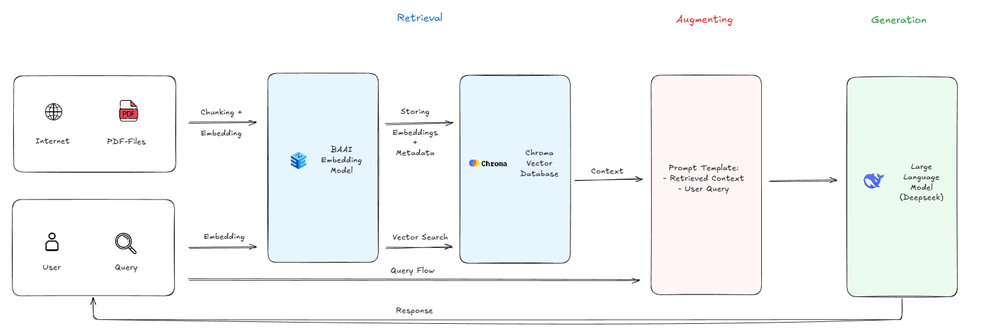

# RAG-for-RAG - A Retrieval-Augmented-System trained on RAG research papers

A naive Retrieval-Augmented Generation (RAG) system designed to answer questions about RAG architectures, technique and research. It is built entirely on top of scientific papers about RAG.

> A RAG that explains RAG.
> Learn RAG by querying a RAG trained on RAG-papers.

This project demonstates how to build a complete RAG pipeline using PDFs as the data source, a modern embedding model, a vector database and a simple prompt-based LLM.

# System Architecture

The following diagram shows the _Naive RAG_ pipeline implemented in this project:

    

